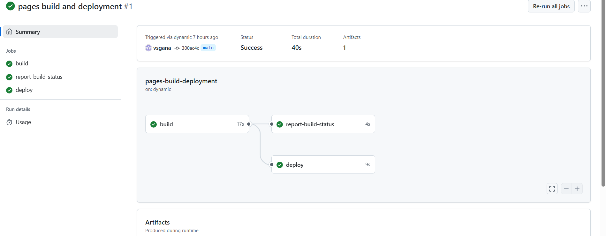

# Deploy a simple HTML website using GitHub Pages
Tools:github pages
## 📁 Project Structure
├── index.html  
├── style.css  
└── script.js  

Open `index.html` in your browser.  

📤 Deployment  
Deployed using GitHub Pages.  
To deploy:  
Push your code to the `main` branch.  
Go to `Settings > Pages` in the GitHub repo.  
Set source to `main` branch and `/ (root)` directory.

https://vsgana.github.io/task-_6/

